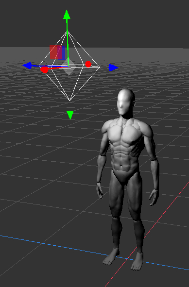

# [x6ud.github.io/figure-doll-editor](https://x6ud.github.io/figure-doll-editor/)

A 3D editor for creating drawing reference models.

Sculpting algorithms are copied from [SculptGL](https://github.com/stephomi/sculptgl).

## [Download models](https://github.com/x6ud/figure-doll-editor/releases/tag/models)

|                                                                      |
|:------------------------------------------------------------------------------------------------------:|
| [std-male](https://github.com/x6ud/figure-doll-editor/releases/download/models/std-male-20230529.doll) |

## Tutorial

Click `File`->`Import...` to import the model.

Rotate the camera with the mouse right button, drag the camera with the mouse middle button.

Rotate the joints with the 
and  tool.


You can flip the model pose by right-clicking the node -> click `Flip`.


### Lighting

Click `Add`->`Point Light` to create a light node.

Move the light with the  tool.

Click the  button in the upper right corner to enable lighting.



### Create boxes

Select  tool. Hold `Alt` to create a box.


### Import models from [Sketchfab](https://sketchfab.com/)

Save your project first.

Click `Sketchfab`->`Sketchfab Login` and jump to Sketchfab's login page, click `ACCEPT`.

Open [https://sketchfab.com/search?type=models](https://sketchfab.com/search?type=models), check `Downloadable`.

Copy the model page address, go back to the editor and paste it in the `Sketchfab`->`Sketchfab Model URL` input box,
press `Enter` and wait for the model to download.

If the model size is too large it may not be visible in the editor. You can resize the model with
the  tool.

### Paint on the model

You can paint on the model with the  tool.

Note that it only works on `Clay` nodes.


### Adjust the model

You can use the  to stretch the model's limbs.


### Rendering with Stable Diffusion and ControlNet

Follow the steps below or [this guide](https://stable-diffusion-art.com/beginners-guide/) to
install [Stable Diffusion web UI](https://github.com/AUTOMATIC1111/stable-diffusion-webui)
and [sd-webui-controlnet](https://github.com/Mikubill/sd-webui-controlnet).

1. Install [Python](https://www.python.org/downloads/);
2. Install [TortoiseGit](https://tortoisegit.org/download/);
3. Copy this address `https://github.com/AUTOMATIC1111/stable-diffusion-webui`, open any folder where you want to
   install the Stable Diffusion, right-click menu -> click `Git Clone...` -> `OK`;
4. Open `webui-user.bat` in text editor, change `set COMMANDLINE_ARGS=`
   to `set COMMANDLINE_ARGS=--api --cors-allow-origins=https://x6ud.github.io`;
5. Run `webui-user.bat`, wait for the web UI to automatically download and install the model;
6. Open `http://localhost:7860`, switch to `Extensions` tab, click `Install from URL`,
   paste `https://github.com/Mikubill/sd-webui-controlnet`, click `Install`, wait for a few seconds, switch
   to `Installed` tab, click `Apply and restart UI`;
7. Open https://huggingface.co/lllyasviel/ControlNet-v1-1/tree/main, click the little `↓` button to download
   every `.pth` model file you want, put the model files
   into `\stable-diffusion-webui\extensions\sd-webui-controlnet\models`. The ControlNet models can be used in Figure
   Doll Editor are `depth`, `canny`, `mlsd`, `scribble` and `pose`.

In Figure Doll Editor, click `Render` -> `Stable Diffusion`. Select and check the ControlNet models you want.

### Shadow nodes

A clone/mirror of the model can be created by right-clicking the node -> click `Create Shadow Node`
or `Create Mirror Shadow Node`.

The names of the shadow nodes are shown in gray. Shadow nodes have the same geometry as the original node, even if the
original geometry is modified.

Sculpting tools cannot be used on shadow nodes.


### Import reference image

You can import reference images by right-click -> `paste`, or `File` -> `Import...`.

### Create rough model with tubes

Select  tool. Hold `Alt` to create a tube. Scroll the mouse wheel while holding `Alt` to
change the size of the tube node.


Select the `Tube` node and change `Symmetry` to `x`, `y` or `z` to enable symmetry.

Select a `Tube Node` node and set `Operator` to `subtract` so that the shape is subtracted from the corresponding part.


### Sculpture

Right-click on the `Tube` node -> click `Convert to Clay` to convert it to a sculptable `Clay` node.

The sculpting tools are similar to those in Blender or ZBrush, you can hold shift to smooth.

The current version does not support automatic mesh subdivision, you need to click the `Remesh` button on the upper
right when selecting a sculpting tool and a `Clay` node to add mesh triangles.

### IK Chain

IK chains are the bones of movable models. They are not the same thing as skinned model bones, but containers with a
rotation center and interval lengths, each IK node contains a limb part of the puppet. This method needs to manually cut
the model into several movable parts, and cannot realize soft body, but does not need to set skinning weights and can
easily replace parts.


Click the `Add` menu to create a IK chain. Check `View` -> `IK Joint Indicators` to display the IK chains.

Use  to modify the rotation center and length of IK joints.

It is recommended to set the front of the model to face the `+X` direction.

## Development

### Project setup

```
npm install
```

### Development

```
npm run dev
```

### Compiles and minifies for production

```
npm run build
```
